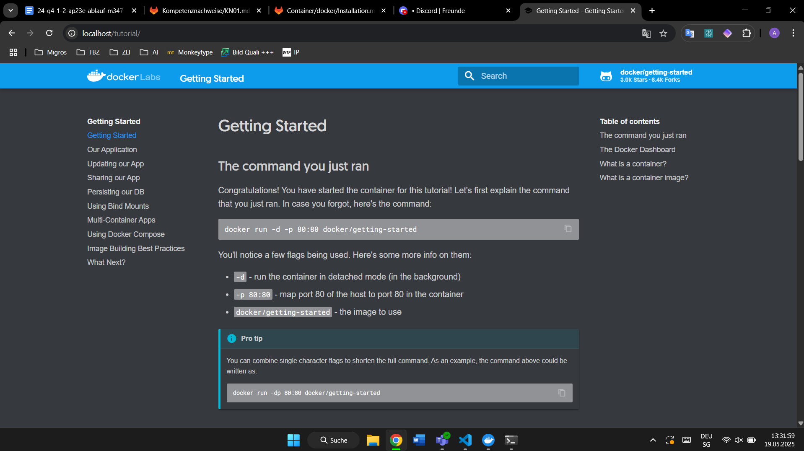
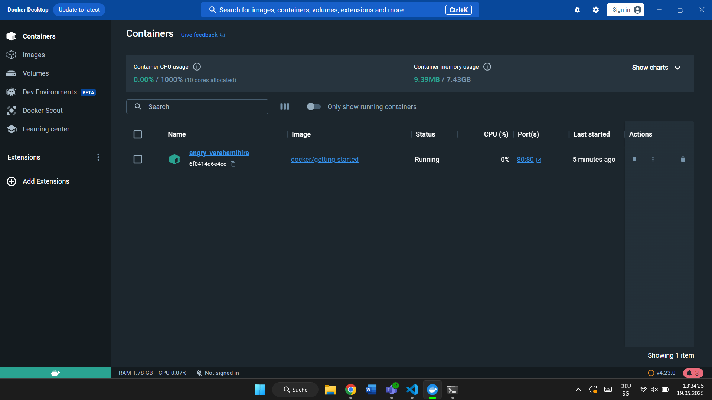
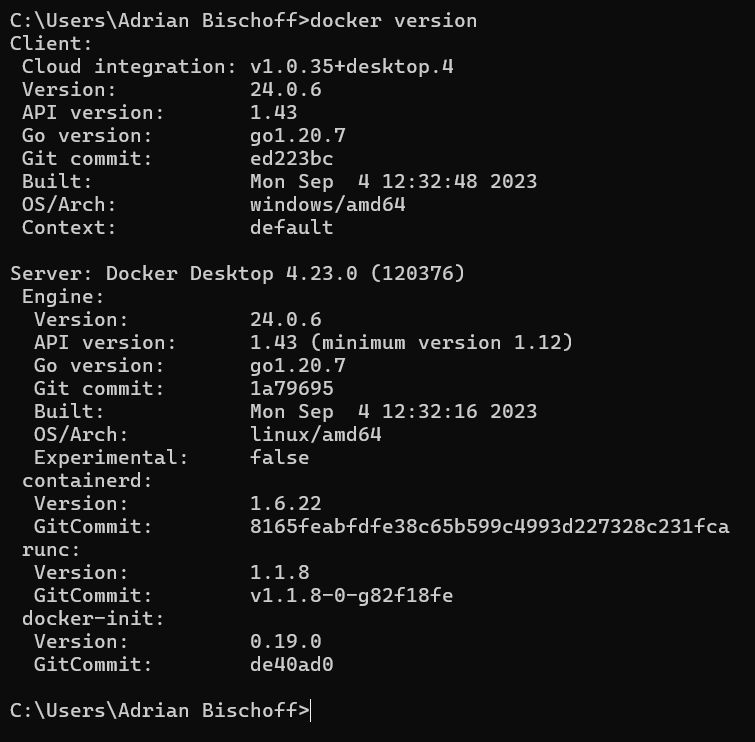
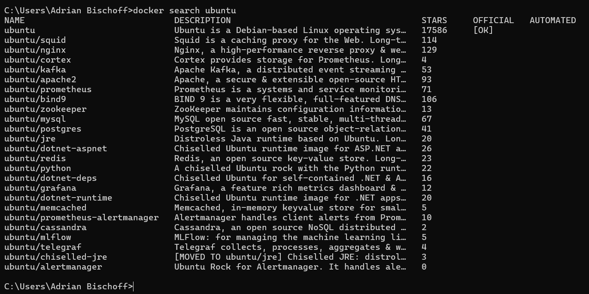
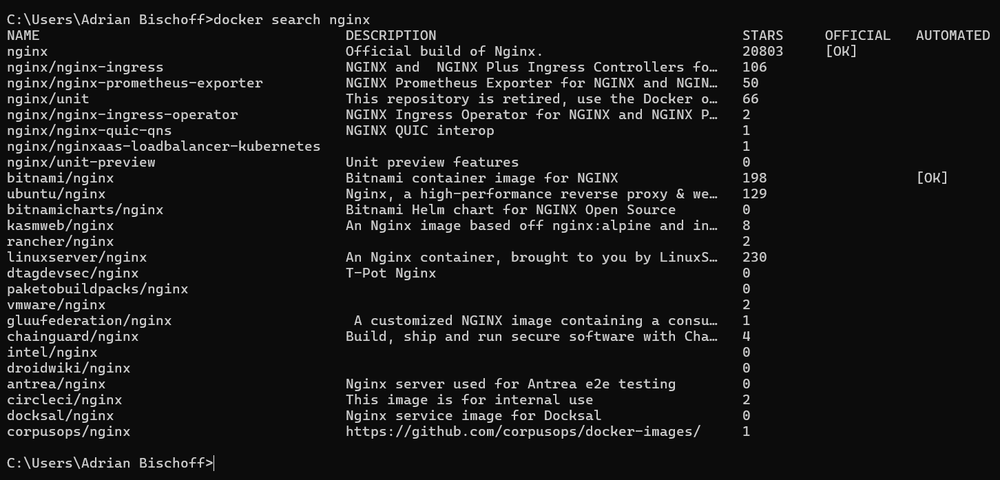
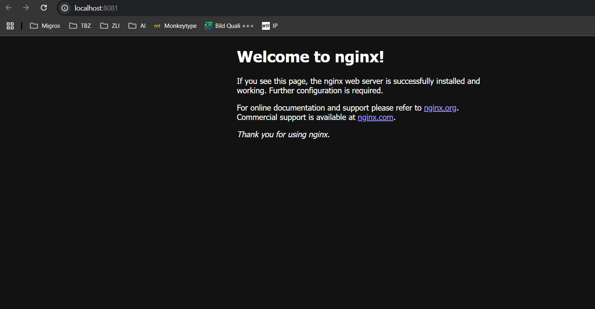
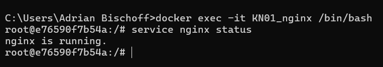
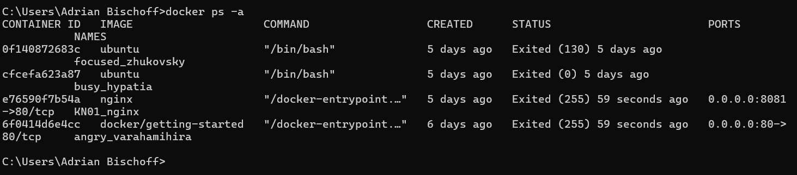
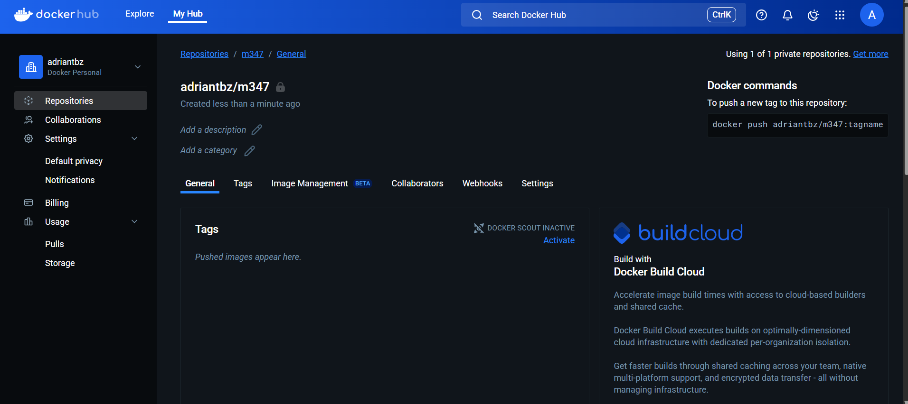
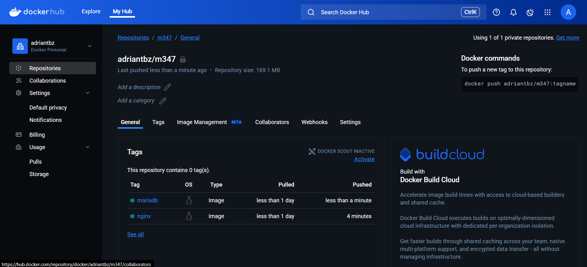

# Aufgabe A





# Aufgabe B

## 1. Docker Version



## 2. Docker Images




## 3.

```
docker run -d -p 80:80 docker/getting-started
```
- ```docker run``` → Startet einen neuen Container
- ```-d``` → Detached Mode (Container läuft im Hintergrund)
- ```-p 80:80``` → Port-Mapping (Host-Port 80 wird an Container-Port 80 weitergeleitet)
- ```docker/getting-started``` → Name des Images, das verwendet wird


## 4.



## 5.
```
docker run -d ubuntu
```
- Das ubuntu Image lokal nicht vorhanden und es wird automatisch von Docker Hub heruntergeladen.
- Der Container wird im Hintergrund (detached) gestartet.

```
docker run -it ubuntu
```
- Der Container wird interaktiv im Terminal gestartet.
- Man landet direkt in der Shell des Ubuntu-Containers.

## 6.



## 7.



## 8.
```	
docker stop KN01_nginx
```

## 9.
```
docker container prune
```

## 10.
```
docker image rm ubuntu nginx oder docker rmi ubuntu nginx
```

# Aufgabe C



# Aufgabe D

```
docker tag nginx:latest adriantbz/m347:nginx
```
Erstellt Target-Image, das von einem Source-Image kopiert wird

```
docker push adriantbz/m347:nginx
```
Pusht ein Lokales image auf das Repo

