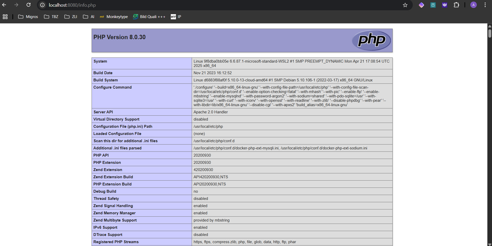

# Aufgabe A

```dockerfile
FROM nginx  # Verwendet das offizielle nginx-Image als Grundlage für den Container
COPY static-html-directory /var/www/html # Kopiert den lokalen Ordner "static-html-directory" in das Verzeichnis "/var/www/html" im Container
EXPOSE 80 # Gibt an, dass der Container auf Port 80 lauschen wird
```

## Docker: Build, Push und Run

```bash
# Image mit Tag für privates Repository erstellen
docker build -t adriantbz/m347:kn02a .
# -t steht für den tag (bennenung des Docker-Images)

# Image in privates Repository pushen
docker push adriantbz/m347:kn02a

# Container aus dem Image starten
docker run -d -p 8080:80 --name nginx-kn02a adriantbz/m347:kn02a
# -d (detached mode) Startet den Container im Hintergrund
# -p mit -p wird der Port definiert
```


# Aufgabe B





## DB Befehle

- docker build -f db.dockerfile -t kn02b-db .
- docker run -d --name kn02b-db -p 3306:3306 kn02b-db

## Web Befehle

- docker build -t kn02b-web .
- docker run -d --name kn02b-web -p 8080:80 --link kn02b-db:db kn02b-web