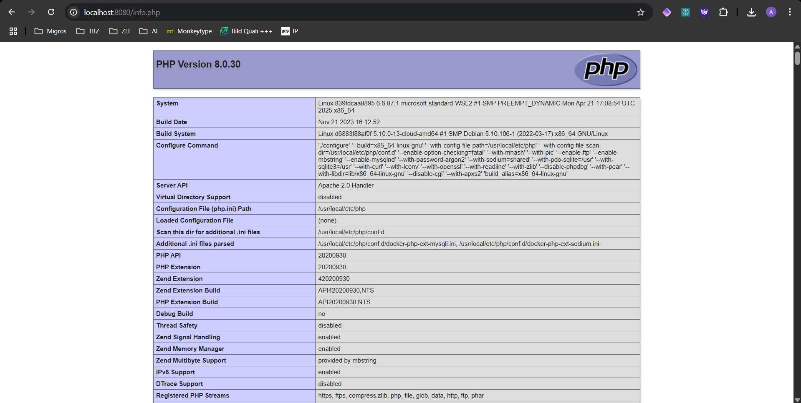
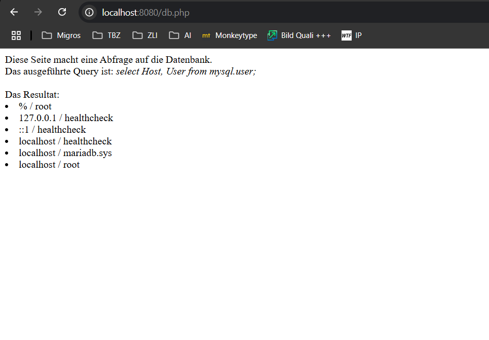

# Aufgabe 1.) A




## Befehle
```bash
docker compose up -d
```

Mit docker compose up startet man das docker compose file im aktuellen Verzeichnis. Das -d steht für detach also im Hintergrund laufen lassen.

# Aufgabe 1.) B