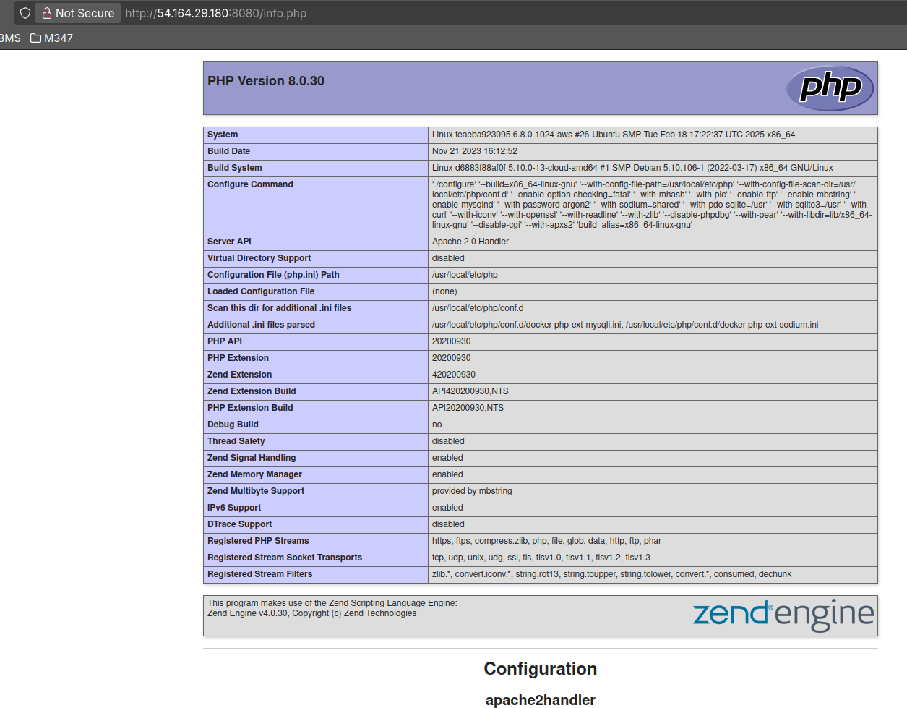
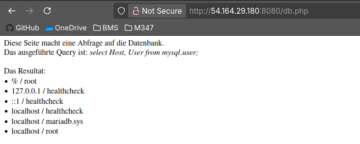

# Aufgabe 1.) A


## Befehle
```bash
docker compose up -d
```

Mit docker compose up startet man das docker compose file im aktuellen Verzeichnis. Das -d steht für detach also im Hintergrund laufen lassen.

# Aufgabe 1.) B


### Warum funktioniert es nicht?
Als wir das Docker-Image für KN02 erstellt haben, hatte `db.php` noch einen anderen Namen in der `$servername`-Variable.
Das heisst, dass im Image noch die alte Version von `db.php` kopiert ist und wir diese nicht für KN04a nutzen können.
Wir könnten allerdings einfach das Image mit dem neuen db.php builden, und schon hätten wir die neue Version des Files im Image verbaut, welche wir in KN04 nutzen können.

# Aufgabe 2.



