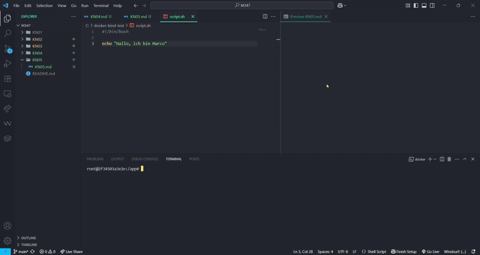
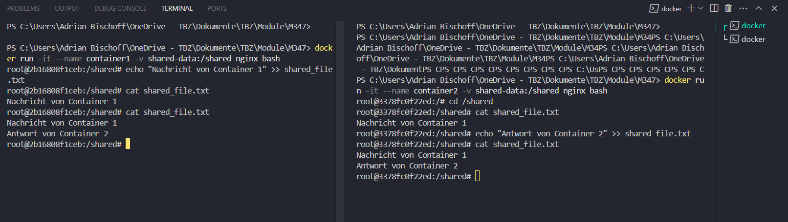
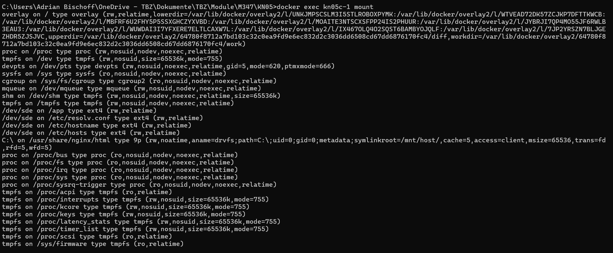
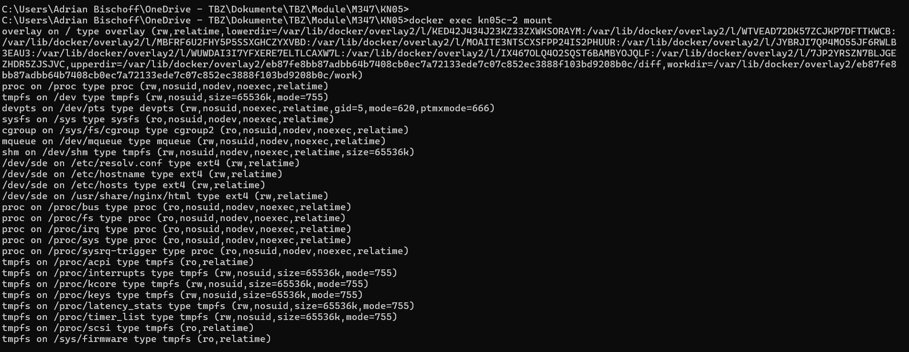

# KN05

## Aufgabe A

```bash
docker run -it --name bind-test -v C:\docker-bind-test:/app nginx bash
```
```bash
cat script.sh
```


[Das Video in besserer Qualität](Images/KN05_Aa.mp4)

## Aufgabe B

```bash
docker volume create shared-data
```
```bash
docker run -it --name container1 -v shared-data:/shared nginx bash
```
```bash
docker run -it --name container2 -v shared-data:/shared nginx bash
```



## Aufgabe C





[docker-compose.yml](docker-compose.yml)